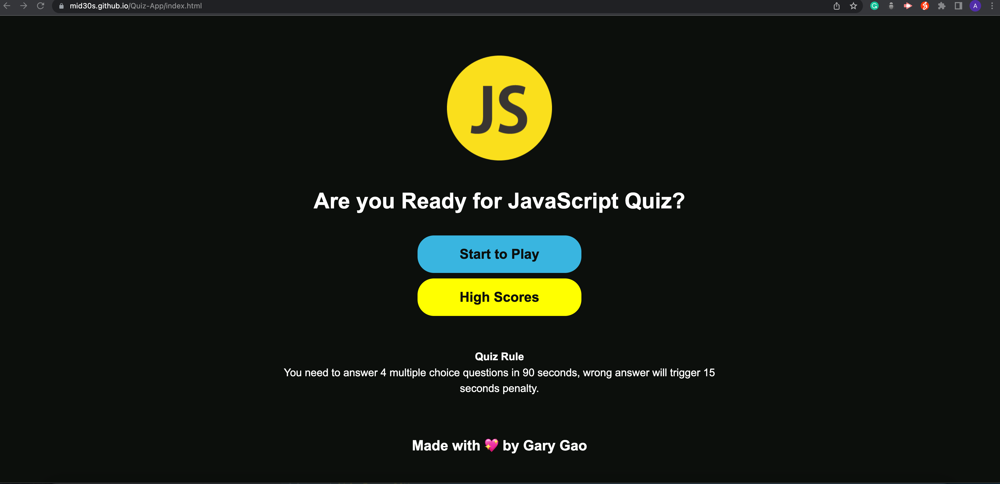
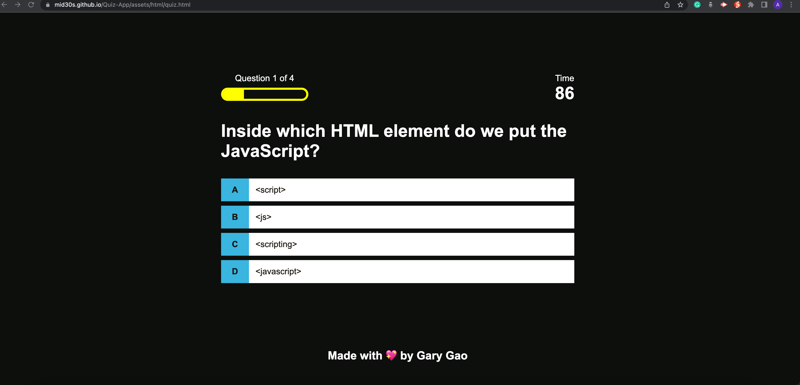
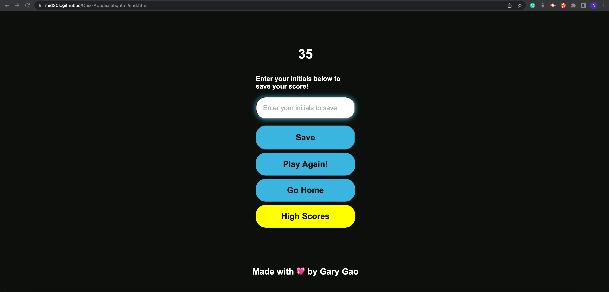
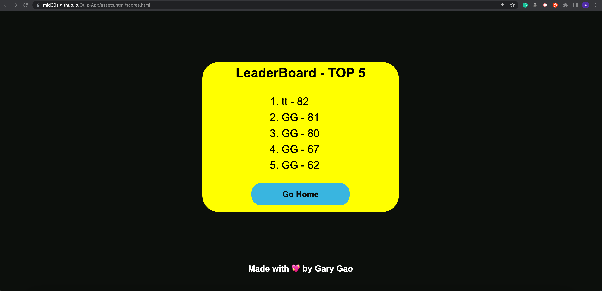

# Quiz-App

Design a timed quiz application that will provide multiple choice questions when user click the start button. After user complete the quiz, user can save the scores to view top 5 high scores in leader board.

## Acceptance Criteria

* GIVEN I am taking a code quiz
* WHEN I click the start button
* THEN a timer starts and I am presented with a question
* WHEN I answer a question
* THEN I am presented with another question
* WHEN I answer a question incorrectly
* THEN time is subtracted from the clock
* WHEN all questions are answered or the timer reaches 0
* THEN the game is over
* WHEN the game is over
* THEN I can save my initials and my score

## Description

Building a timed quiz app was a great way to further test my knowledge on Web API's and review my skill on css and html as well. 

At the beginning, my plan is using one html/CSS/JavaScript file to complete the application. In order to practice my html and css knowledge. I decide to spend a little bit more time on how to make it looks nicer. So I create 4 html files, 4 css files and 3 JavaScript files. I may spend more time on the application, but it is definitely worth to do it.

To go through the quiz,when you click on the correct answer, the current box turn green and run getNewQuestion function again. When you click a wrong answer the current box turns red and 15 seconds time is deducted.  This continues until reach the max number of the quiz. Then user can type their name to save the high score.

The most I learn from this project is how to solve the problem, when I have problem, I just search in MDN docs, it always gives me a great method to solve my problem. For example, I learn 
- map() method, 
- splice() method,
- forEach() method, 
- sort() method,
- push() method,

All this methods are useful, I also learn some tricks to make my code simple. For instance: I use the following code rather than a "if statement". It will save a lot of time in future.

[let classToApply = selectedAnswer == currentQuestion.theAnswer ? 'correct' :'incorrect' ]

## Made With

## Installation

N/A

## Usage

To view this application,the following image shows the landing page of the application, or click on https://mid30s.github.io/Quiz-App/

## Credits

N/A

## License

Please refer to the LICENSE in the repo.